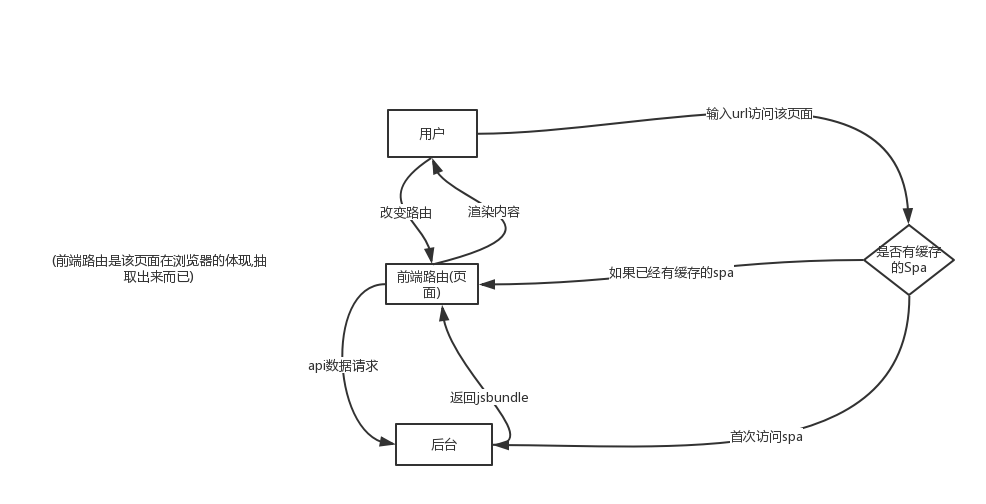
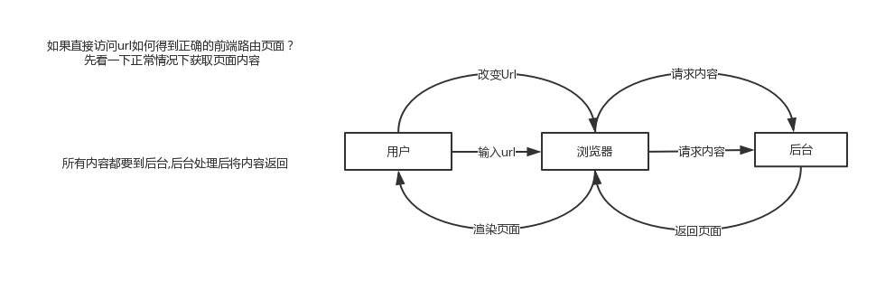
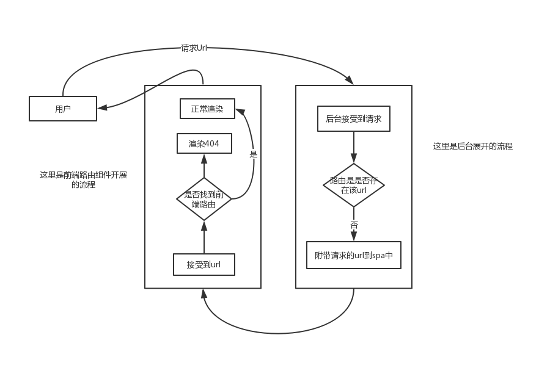

# 处理路由重定向的问题

SPA应用中一定会涉及路由问题。

## 使用前端路由的情况
  


## 正常渲染的情况



## 路由重定向的思路


## 代码

### koa2

处理所有服务器重定向问题都通过 '/?' + url

```
app.use(async(ctx, next) => {
	await next();
	//保证附带cookie
	if(!ctx.session){
		ctx.session.flag = 1
	}
	if (ctx.response.status == 404) {
		ctx.response.redirect('/?' + ctx.request.url);
	}
})
```
### 重定向控件

```
const RedirectFromServer = ({match})=>{
  //deal the sever redirect
  let url = window.location.search;
  return url.substring(1)?<Redirect to={{
    pathname: url.substring(1),
    state: { from: '/' }
  }}/>:<NoMatch/>
}
```

```
 <Switch>
             <Route exact path="/index" component={Index}/>
             <Route path="/login" component={Login}/>
             <Route path="/loginOut" component={Login}/>
             <Route path="/register" component={Register}/>
             <Route path="/user" component={UserIndex}/>
             <Route path="/article" component={ArticleDetail}/>
             <PrivateRoute path="/edit/article"
               component={EditArticle}
               auth={auth}
             />
             <PrivateRoute
               path="/personal/index"
               component={AccessArticles}
               auth={auth}
             />
             <PrivateRoute
               path="/postArticle"
               component={PostArticle}
               auth={auth}
             />
             <Route  path="/" component={RedirectFromServer}/>
           </Switch>
```


